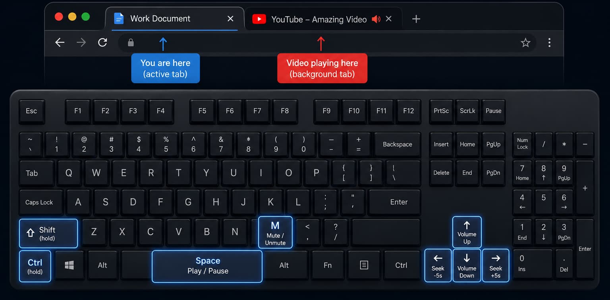

# Quick Control Video Extension  

An extension that lets you control videos playing in any tab using keyboard shortcuts. Works on YouTube, Shorts, and most HTML5 video players. Compatible with Google Chrome and Firefox.

  

### Shortcuts:

| Action           | Suggested Shortcut     |
| ---------------- | ---------------------- |
| Play / Pause     | `Ctrl + Shift + Space` |
| Seek backward 5s | `Ctrl + Shift + Left`  |
| Seek forward 5s  | `Ctrl + Shift + Right` |
| Volume up 10%    | `Ctrl + Shift + Up`    |
| Volume down 10%  | `Ctrl + Shift + Down`  |
| Toggle mute      | `Ctrl + Shift + M`     |

**Shortcuts must be configured manually after installation.**  
- **Chrome:** `chrome://extensions/shortcuts`  
- **Firefox:** `about:addons` → gear icon → **Manage Extension Shortcuts**

## Installation

### Chrome
Official Chrome webstore page: [https://chromewebstore.google.com/detail/keaakadjjomechemoalnjhpnmijdccmf](https://chromewebstore.google.com/detail/keaakadjjomechemoalnjhpnmijdccmf)

### Firefox
Official Firefox Add-ons page: [https://addons.mozilla.org/en-US/firefox/addon/quick-control-video-extension/](https://addons.mozilla.org/en-US/firefox/addon/quick-control-video-extension/)

### Development
1. Download or clone this repository  
2. Run `powershell -File build.ps1` to generate browser-specific builds  

**Chrome:**  
3. Open Chrome and visit: `chrome://extensions/`  
4. Enable **Developer mode**  
5. Click **Load unpacked**  
6. Select the `dist/chrome` folder  

**Firefox:**  
3. Open Firefox and visit: `about:debugging#/runtime/this-firefox`  
4. Click **Load Temporary Add-on**  
5. Select `dist/firefox/manifest.json`  

## Contributing

Contributions are welcome!  
Open issues or submit pull requests with improvements or fixes.

## License

This project is open source and released under the **MIT License**.  
See the [LICENSE](LICENSE) file for details.

## Privacy Policy

This extension does not collect, transmit, or store personal information. All actions are performed locally in the browser. No analytics or external servers are used.
